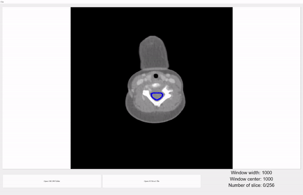
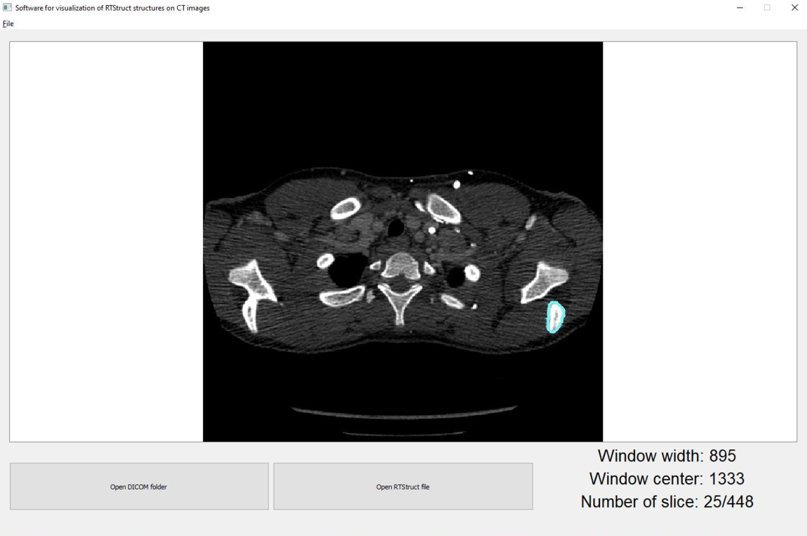

# RTStruct Visualization Software - academic project



## Features

- **Data Loading**: Load CT images and corresponding RT Struct files.
- **Data Validation**: Verify the correctness of loaded data to ensure compatibility with the application.
- **Data Conversion**: Utilize external image processing libraries for data conversion tasks.
- **Image Fusion**: Combine CT scans with RT Struct data to provide comprehensive visualizations.
- **Graphical Interface**: Intuitive interface for viewing CT scans in 2D with overlaid RT Struct contours.
- **Adjustable Windowing**: Customize CT scan window width and height based on the Hounsfield scale.
- **Export Functionality**: Export displayed results to graphic files in various formats.

## Getting Started

### Dependencies

Build environment has Python 3.8.19 with conda

```bash
conda create -n "myenv" python=3.8.19
```

### Prerequisites

Ensure you have the following dependencies installed with Python3.8:

```sh
> pip install numpy
> pip install pydicom
> pip install opencv-python
> pip install matplotlib
> pip install PyQt5
```

## Testing

```sh
> python unit_test.py
```

## Execution
To run the code, type:

```sh
> python app.py
```



## Documentation

Documentation is generated based on docstrings in the code. To generate documentation, use a documentation generator such as Sphinx.


## Application Overview

### Start View

Upon launching the application, users are presented with a start view. From here, they can add CT and RT Struct files or exit the application.

### File Saving Options

Users have the flexibility to save the visualized results in any format of their choice. The saving process is detailed below, with the exported image in PNG format appended at the end.
